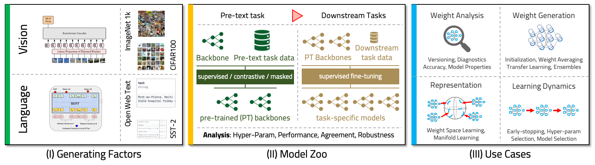
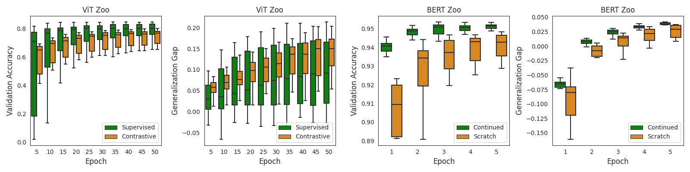

# TransformerModelZooDataset
Model Zoos submitted to the NeurIPS 2024 Dataset &amp; Benchmark track: "Transformer Model Zoos and Soups: A Population of Language and Vision Models"



## Introduction

The investigation of poplutaions of neural networks has gained momentum in recent years.
Fuelled by the availability of such populations or so called ``model zoos'', multiple approaches have been proposed for a multitude of different downstream tasks including (i) model analysis, (ii) discovery of learning dynamics, (iii) representation learning on model weights, or (iv) generative modeling of neural network weights and biases. Unfortunately, currently available model zoos are limited in size and architecture. Firstly, they are restricted to CNNs or RNNs, neglecting the Transformer, which is among the currently most successful neural network architectures. Secondly, most model zoos focus on computer vision tasks and neglect language models.

We address the gap by introducing model zoos of state-of-the-art architectures: we publish a dataset of Transformer model zoos, which for the first time covers both computer vision and natural language processing. To achieve this, we develop a new blueprint for model zoo generation that encompasses both pre-training and fine-tuning steps. We publish 250 vision and 40 language models that cover a large span of generating factors and thoroughly evaluate their behavioral diversity. We suggest multiple possible applications grounded in examples from the literature and show how our dataset can be used to extend them. Finally, we illustrate how our zoos can be used to unlock novel applications: we present early experiments on model weights averaging in transformer models, and show where these approaches succeed. This paper, by extending previous lines of similar work, will allow researchers to push their model population-based methods from the small model regime to state-of-the-art architectures. 

This repository contains the code required to train and evaluate the models in the zoo. We include a sample of the full dataset, which will be made available before the conference. The full dataset will include all backbone models, and the populations generated from them. An overview of the performance of the models in the zoo is shown in the following figure:



## Installation

### Requirements

The packages required to run the code are listed in the `requirements.txt` file. You can install them using the following command:

```bash
pip install -r requirements.txt
```

## Usage

### Downloading the dataset

The dataset sample is available for download from the following [link](https://www.example.com). It is structured as follows:

```
- dataset
    - vision
        - pretraining
            - model 1
                - checkpoint_0000XY
                - config.json
                - result.json
            - ...
        - finetuning
            - pretrained model 1
                - model 1
                    - checkpoint_0000XY
                    - config.json
                    - result.json
                - ...
    - language
        - pretraining
            - model 1
                - checkpoint_0000XY
                - config.json
                - result.json
            - ...
        - finetuning
            - pretrained model 1
                - model 1
                    - checkpoint_0000XY
                    - config.json
                    - result.json
                - ...
```

The pretrained models are stored in the `pretraining` folders, their names include the generating factors used to create them. The finetuned models are stored in the `finetuning` folders and are ordered per pretrained model they were finetuned from. Each model directory contains a `config.json` file with the model configuration `result.json` file with the model performance metrics. Moreover, it includes checkpoints of the model per 10 epochs of training in the format `checkpoint_0000XY/checkppints`. The sample dataset only includes a few models and a limited number of checkpoints. The full dataset will be made available before the conference.

### Loading a model

To instantiate a model, simply instantiate the `NNModule` class with the `config.json` file of the model you want to load. To load a checkpoint, load the state dictionary of the checkpoint and load it into the model. The following code snippet demonstrates how to load a model and a checkpoint:

```python
import torch
import json
from experiment_runner.def_net import NNModule

# Load the model configuration
config = json.load(open('path/to/config.json'))
model = NNModule(config)

# Load the model checkpoint
checkpoint = torch.load('path/to/checkpoint_0049/checkpoints')
model.model.load_state_dict(checkpoint)
```

### Training a model

To train a model, data preprocessing is required, which is detailed in the section below. After preprocessing the data, models can be trained using ray tune. The process is similar to before, but now includes an experiment runner that handles the training process. We include sample scripts and configurations for both pre-training and finetuning of the language and vision models, see the `experiments` folder.

#### Data preprocessing

The data preprocessing is different for the language and vision models. For the language models, the data is tokenized and split into training and validation sets. For the vision models, the data is loaded from the dataset and split into training and validation sets.

We include sample scripts for the data preprocessing in the `data_preparation` folder. These scripts are used to create dataset dumps that can be loaded into the training scripts. Once a dataset dump is created, it can be loaded automatically by providing the path to the dump in the configuration.

```python
config['dataset::dump'] = 'path/to/dataset/dump'
```

Please note that the dataset class needs to be imported in the experiment file to load the dataset dump successfully.

```python
from datasets.sst import SSTDataset
```

#### Training a model from scratch

To train a model from scratch, simply instantiate a configuration file and pass it to the experiment runner. We include sample configurations for the language and vision models in the `example_configs` folder as well as corresponding experiment runners in the `experiments` folder.

The following code snippet demonstrates how to train a model from scratch:

```python
import logging
from experiment_runner.def_nn_experiment import NN_tune_trainable
import ray

import json
import torch
from pathlib import Path

PATH_ROOT = Path(".")

def main():
    cpus = 12
    gpus = 1

    cpu_per_trial = 12
    gpu_fraction = ((gpus * 100) // (cpus / cpu_per_trial)) / 100
    resources_per_trial = {"cpu": cpu_per_trial, "gpu": gpu_fraction}

    
    config = json.load(open("example_configs/vision/config_vit_finetuning.json", "r"))
    config["cuda"] = True if gpus > 0 and torch.cuda.is_available() else False
    config["dataset::dump"] = "path/to/dataset/dump"

    experiment_name = "VIT_FINETUNING"
    net_dir = PATH_ROOT.joinpath(experiment_name)
    try:
        net_dir.mkdir(parents=True, exist_ok=False)
    except FileExistsError:
        pass
    print(f"Saving models to {net_dir.absolute()}")

    context = ray.init(
        num_cpus=cpus,
        num_gpus=gpus,
    )
    assert ray.is_initialized() == True

    if config.get("dataset::dump", None) is not None:
        print(f"loading dataset from {config['dataset::dump']}")
        dataset = torch.load(config["dataset::dump"])
        dataset_ref = ray.put(dataset)

    config["dataset::ref"] = dataset_ref

    experiment = ray.tune.Experiment(
        name = experiment_name,
        run = NN_tune_trainable,
        stop = {
            "training_iteration": config["training::epochs_train"]
        },
        checkpoint_config= ray.air.CheckpointConfig(
            num_to_keep=None,
            checkpoint_frequency=config.get("training::output_epoch", 1),
            checkpoint_at_end=True,
        ),
        config=config,
        local_dir=net_dir.absolute(),
        resources_per_trial=resources_per_trial,
    )

    ray.tune.run_experiments(
        experiments = experiment,
        resume = False,
        reuse_actors = False,
        verbose = 3,
    )

    ray.shutdown()

if __name__ == "__main__":
    main()
```


#### Fine-tuning a model

To finetune from a pretrained model, the path to the pretrained model checkpoint must be provided in the configuration. The following code snippet demonstrates how to finetune a model:

```python
config['pretrained::model::path'] = 'path/to/pretrained/model/checkpoint_0000XY/checkpoints'
```

This will automatically load the pretrained model checkpoint into the model before training and replace the classification head for finetuning. The training process is the same as before, but now the model is loaded with the pretrained weights.

#### Defining a grid to generate populations

To generate populations of models, a grid of hyperparameters must be defined. The grid is defined in the configuration file and is used to generate a population of models. The following code snippet demonstrates how to define a grid:

```python
config['optim::lr'] = tune.grid_search([1e-3, 1e-4, 1e-5])
config['optim::weight_decay'] = tune.grid_search([1e-3, 1e-4, 1e-5])
```

Ray tune will generate a model for each combination of hyperparameters in the grid. The population can be generated by running the experiment runner with the grid configuration.

### Configurations

#### Vision models

The configuration for the vision models is defined in the `config_vit_pretraining.json` file. The configuration includes the following parameters:

- `model::name`: The name of the model to be trained.
- `model::o_dim`: The output dimension of the model.
- `model::type`: The type of the model, either `vit_s_16` for Vision Transformer or `bert` for BERT.
- `dataset::name`: The name of the dataset to be used for training.
- `dataset::dump`: The path to the dataset dump.
- `optim::optimizer`: The optimizer to use for training.
- `optim::lr`: The learning rate for training.
- `optim::weight_decay`: The weight decay for training.
- `validation::loss`: The loss function to use for validation, if different from the training loss.
- `training::loss`: The loss function to use for training.
- `training::batchsize`: The batch size for training.
- `training::epochs_train`: The number of epochs to train the model.
- `training::output_epoch`: The frequency of saving checkpoints during training.
- `training::mode`: The training mode, either `cl` for contrastive learning or `sl` for supervised learning.
- `training::mixup`: Mixup ratio to use for training, None if not used.
- `training::cutmix`: Cutmix ratio to use for training, None if not used.
- `training::randerase`: Randerase ratio to use for training, None if not used.
- `trainloader::num_workers`: The number of workers for data loading.
- `cuda`: Whether to use CUDA for training.
- `seed`: The random seed for training.

For finetuning, the configuration is defined in the `config_vit_finetuning.json` file. The configuration includes the same parameters as the pretraining configuration. If the model is finetuned from a pretrained model, the path to the pretrained model checkpoint must be provided in the configuration.

- `pretrained::model::path`: The path to the pretrained model checkpoint.

#### Language models

The configuration for the language models is defined in the `config_mlm.json` and `config_sst.json` file. The configuration works similarly to the vision models but includes additional parameters for the language models.

- `pretraining::case`: The case of the model, either `continued` or `scratch`.

## Further information

For the full dataset we will provide further code for the evaluation of the models in the zoo as well as code to create and evaluate the model soups. Additionally, we will provide a general dataset class that can be used to load multiple models at once including configuration and results and evaluate them automatically.

